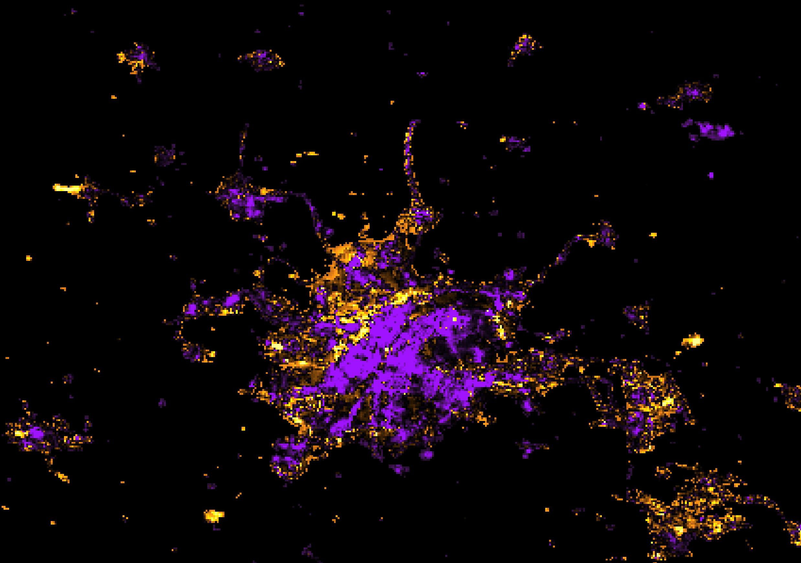

# Global Changes in Energy Consumption During COVID-19

[Francisco Rowe](http://www.franciscorowe.com) [[`@fcorowe`](http://twitter.com/fcorowe)]1, Caitlin Robinson[[@CaitHRobin](https://twitter.com/CaitHRobin)]1, Nikos Patias [[`@pat_nikos`](https://twitter.com/pat_nikos)]1

1 *Geographic Data Science Lab, University of Liverpool, Liverpool, United Kingdom*

Access to the application and code: https://code.earthengine.google.com/?accept_repo=users/fcorowe/covid_energy

Manuscript: [Link Google Doc](https://docs.google.com/document/d/16yfj-mQDofC43qAfZ6NrvdFOvoaINJ4V_lJV4X7ZafY/edit)

# Data

Analysis: 

- [Night time light changes](https://docs.google.com/presentation/d/1uIEpqh5ksxR_EQAANKzo1llwAbKQPg8VwI9uGqFiCNU/edit#slide=id.p6)

- [Index: Stringency of government response](https://docs.google.com/presentation/d/1-DbRcIJzy0QAyOLzEhcV44P_jFEZLPv7HZpxbWU9HrA/edit#slide=id.p3)

- [Basic Demographic Characteristics (Gridded Population of the World Version 4.11)](https://developers.google.com/earth-engine/datasets/catalog/CIESIN_GPWv411_GPW_Basic_Demographic_Characteristics#bands)

- [Estimated Residential Population per 100x100m Grid Square](https://developers.google.com/earth-engine/datasets/catalog/WorldPop_GP_100m_pop#description)

# References

Ruan, G., Wu, D., Zheng, X., Sivaranjani, S., Zhong, H., Kang, C., Dahleh, M.A. and Xie, L., 2020. [A Cross-Domain Approach to Analyzing the Short-Run Impact of COVID-19 on the US Electricity Sector.](http://www.enerarxiv.org/thesis/1594622565.pdf)

