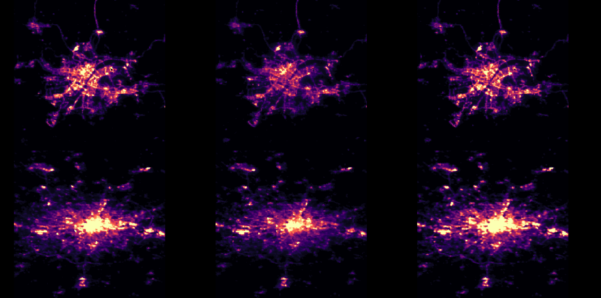

# Global Changes in Energy Consumption During COVID-19

[Francisco Rowe](http://www.franciscorowe.com) [[`@fcorowe`](http://twitter.com/fcorowe)]<sup>1</sup>, Caitlin Robinson [[`@CaitHRobin`](https://twitter.com/CaitHRobin)]<sup>1</sup>, Nikos Patias [[`@pat_nikos`](https://twitter.com/pat_nikos)]<sup>1</sup>

<sup>1</sup> *Geographic Data Science Lab, University of Liverpool, Liverpool, United Kingdom*

This repository stores the required code and data to replicate the results of the following article:

```
Rowe, F., Robinson, C., Patias, N. 2021. Sensing Global Changes in the Local Patterns of Energy Consumption in Cities During the Early Stages of the COVID-19 Pandemic.
```

This paper analyses changes in urban energy consumption during the early stages of the pandemic for a sample of major global cities. Particularly the paper seeks to:
* measure city-scale changes in energy consumption in response to COVID-19;
* determine the extent of shifts in spatial patterns of intra-urban energy consumption;
* investigate potential explanations for changes in urban energy consumption.



## Citation

If you use the code and/or data in this repository, we would appreciate if you could cite the pre-print paper as:

```
@article{rowe_et_al2022ne,
  title={Sensing Global Changes in Local Patterns of Energy Consumption in Cities During the Early Stages of the COVID-19 Pandemic},
  author={Rowe, Francisco and 
          Robinson, Caitlin and 
          Patias, Nikos},
  journal={Cities},
  DOI={[https://doi.org/10.21203/rs.3.rs-846222/v2](https://doi.org/10.1016/j.cities.2022.103808)}
  year={2022},
}
```

The repository is also registered on the [Open Science Framework](https://doi.org/10.17605/OSF.IO/P74QR)
